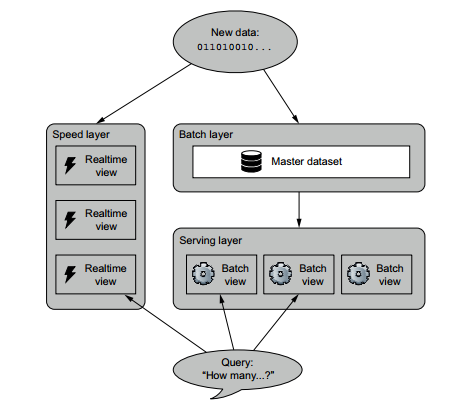

# Lambda Architecture

Suppose we want to build a system to find popular hash tags in a twitter stream, we can implement lambda architecture using Apache Spark to build this system.

## Batch Layer Implementation
Batch layer will read a file of tweets and calculate hash tag frequency map and will save it to Cassandra database table.

## Speed Layer Implementation
Speed layer can also be written in Apache spark using spark streaming feature. We can get a stream of recent tweets and calculate recent real time view from this stream we can also save this real time view to Cassandra for simplicity.

## Serving Layer implementation
Serving layer can be implemented as a RESTful web service which will query Cassandra tables to get the final result in real time.

Enjoy!